# Projeto de ETL com PySpark, Docker e PostgreSQL

## 📚 Índice

- [Arquitetura](#arquitetura)
- [Descrição](#descrição)
- [Ferramentas Utilizadas](#ferramentas-utilizadas)
- [Sobre o Projeto](#sobre-o-projeto)
  - [1. Arquivo start_cluster.sh](#1-arquivo-start_clustersh)
  - [2. Arquivo stop_cluster.sh](#2-arquivo-stop_clustersh)
  - [3. Arquivo docker-compose.yml](#3-arquivo-docker-composeyml)
  - [4. Arquivo etl_script.py](#4-arquivo-etl_scriptpy)
- [Pontos de Melhoria](#pontos-de-melhoria)

---

## Arquitetura

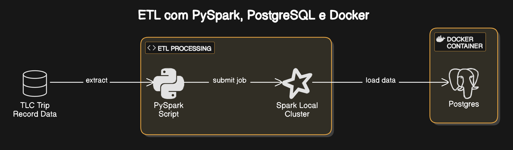

---

## Descrição

Este projeto implementa um pipeline ETL (Extract, Transform, Load) utilizando PySpark para processar dados de táxis de Nova York. Os dados são baixados de uma fonte remota, processados em um cluster Spark local e carregados em um banco de dados PostgreSQL.

---

## Ferramentas Utilizadas

- **Docker** - Para containerização dos serviços
- **PostgreSQL** - Banco de dados relacional
- **PgAdmin** - Interface gráfica para administração do PostgreSQL
- **PySpark** - Framework para processamento distribuído
- **Shell Script** - Para automação de tarefas

---

## Sobre o Projeto

### Pré-requisitos

Foi necessário instalar o Java (11.0.2) e o Apache Spark (3.3.2), além de configurar as variáveis de ambiente no arquivo `.bashrc`. 

Também foi feito o download do driver JDBC do PostgreSQL, compatível com a versão do Java, disponível em:  
[https://jdbc.postgresql.org/download/](https://jdbc.postgresql.org/download/)

O driver foi colocado na pasta `jars` do Spark.

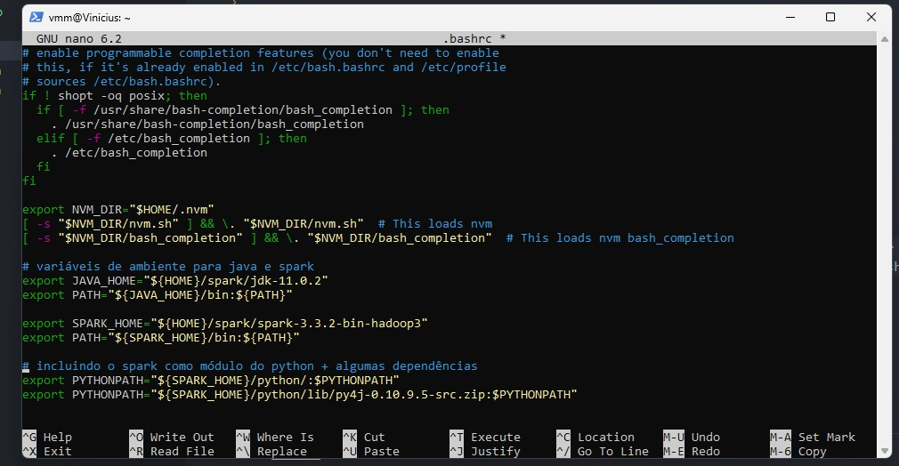

---

### **1. Arquivo start_cluster.sh**

Script que automatiza a inicialização de um cluster Spark local com um master e um worker. O processo inclui:

1. Inicialização do master
2. Extração da URL do master a partir dos logs
3. Inicialização do worker conectado ao master

Cluster sendo implantado.
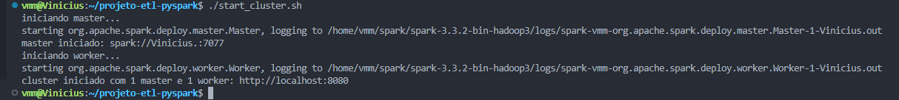

GUI do endereço do master.
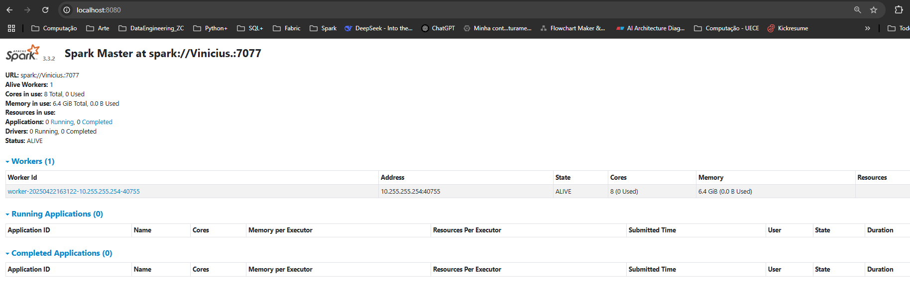

O arquivo é bem autoexplicativo, e a única complexidade dele está neste trecho, onde é feita a extração da URL
a partir dos arquivos de log do Spark, contidos na pasta de instalação:

```bash
# 'ls -t' lista os arquivos de log a partir das datas de modificação, da mais recente pra mais antiga
# o pipe '|' passa a saída para o head, que retorna o primeiro nome de arquivo da lista
MASTER_LOG=$(ls -t "$SPARK_HOME"/logs/spark-*-org.apache.spark.deploy.master*.out | head -1)

# '-z' checa se a string é vazia ou nula
if [ -z "$MASTER_LOG" ]; then
    echo "não foram encontrados logs do master em $SPARK_HOME/logs"
    exit 1
fi

# usando 'grep' com regex para pegar o padrão de url do master do arquivo de log mais recente
# o pipe '|' passa a saída e pega a última linha, que é a url mais recente
MASTER_URL=$(grep -o 'spark://[^ ]*' "$MASTER_LOG" | tail -1)

if [ -z "$MASTER_URL" ]; then
  echo "não foi possível obter a url do master"
  exit 1
fi
```

### **2. Arquivo stop_cluster.sh**

Script para encerramento ordenado do cluster, parando primeiro o worker e depois o master.

```bash
#!/bin/bash

SPARK_HOME="/home/vmm/spark/spark-3.3.2-bin-hadoop3"

echo "parando worker..."
"$SPARK_HOME/sbin/stop-worker.sh"

echo "parando master..."
"$SPARK_HOME/sbin/stop-master.sh"

echo "cluster encerrado"
```

Output do script de parada.

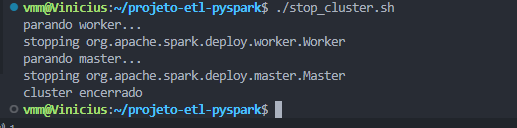

### **3. Arquivo docker-compose.yml**

Configuração dos serviços PostgreSQL e PgAdmin com persistência de dados em volumes locais.

**Acesso:**
- PgAdmin: [http://localhost:5000](http://localhost:5000)
- PostgreSQL: `localhost:5432`

PgAdmin implantado.
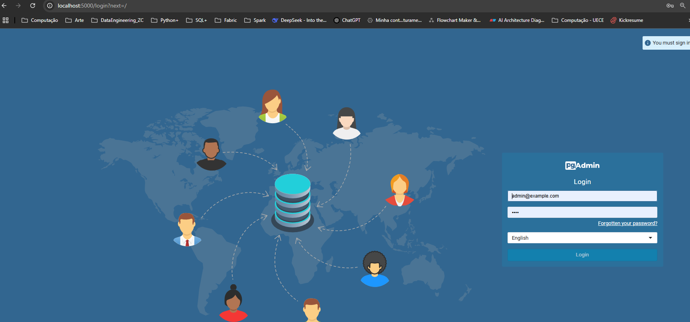

O host do banco de dados é o nome do serviço definido no arquivo `docker-compose.yml`.
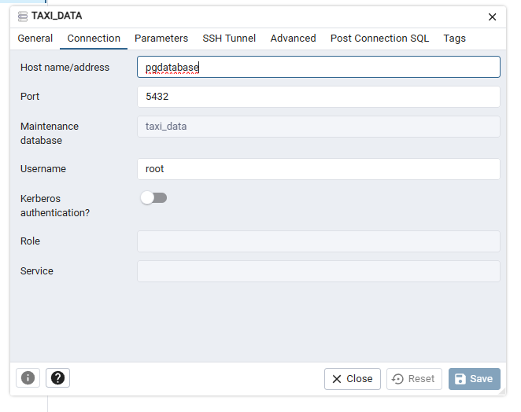

Nome do serviço no arquivo `docker-compose.yml`.
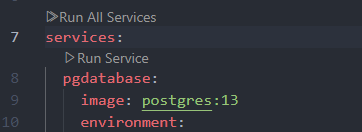

### **4. Arquivo etl_script.py**

O script realiza três etapas principais:

1. **Download dos dados**: Baixa arquivos Parquet de uma fonte remota.

```python
def download_parquets(taxi_type: str, year: str) -> None:
    '''
    Recebe o tipo do taxi (green ou yellow) e o ano do dataset. 
    Monta as url's de acordo com os inputs recebidos. 
    Requisita os dados de todos os meses em que houve registros e escreve em arquivos .parquet.
    '''
...
```

2. **Leitura dos dados**: Utiliza o Spark para ler os arquivos baixados.

Já que todos os arquivos baixados possuem a mesma estrutura de metadados, é possível
ler todos em um único data frame automaticamente.

```python
df = spark.read \
         .parquet(f'data/raw/{taxi_type}/{year}/*')
```

3. **Carga no banco**: Insere os dados no PostgreSQL de forma particionada e em lotes de 10000 registros, para evitar sobrecarga de memória.

```python
def ingest_on_postgres(df, table, user, pwd, db):
    '''
    Recebe o dataframe com os dados lidos dos arquivos .parquet e os dados da conexão ao banco de dados
    para realizar a ingestão. 
    '''
...
```

O job é submetido ao cluster Spark através do comando `spark-submit` com parâmetros configuráveis.
A parametrização foi conseguida através da biblioteca `argparse`, do Python.

```bash
MASTER_URL="spark://Vinicius.:7077"

spark-submit \
    --master="${MASTER_URL}" \
    etl_script.py \
        --taxi_type yellow \
        --year 2024 \
        --db_name taxi_data \
        --db_pwd root \
        --db_user root
```

**Resultados:**

Job em execução.
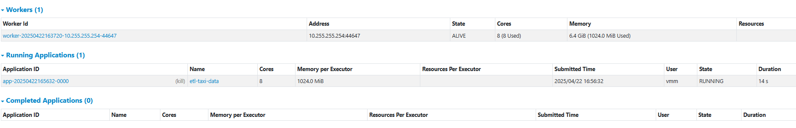

Job finalizado.
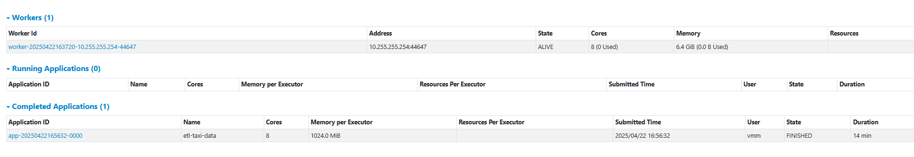

Registros inseridos.
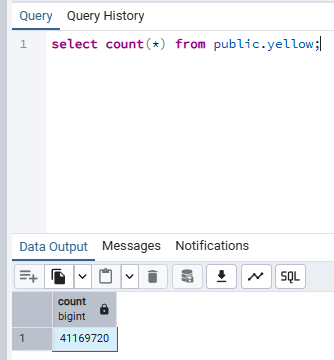

---

## Pontos de Melhoria

1. **Utilização de um orquestrador**  
   Adoção de ferramentas como Airflow ou Kestra para melhor escalabilidade e monitoramento.

2. **Implantação de mais workers**  
   Aumentar o número de workers para melhor aproveitamento do processamento paralelo.

3. **Tratamento de Dados**  
   Implementar transformações para enriquecer a qualidade dos dados para análise OLAP.

